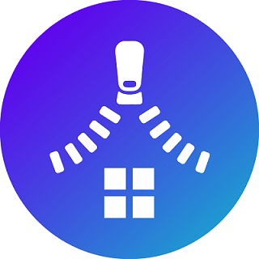

# :house: ZIP(집)

- 사랑하는 가족과 매일 주어지는 미션을 통해 소통하고, 메타버스를 결합해 소통을 즐겁게 만드는 

  **게이미피케이션 + 메타버스 결합 가족 소통 어플리케이션**

- 📜 [노션](https://www.notion.so/1-Unity-650232b21f5841e8be9da51457735050)

<br/>
<br/>


## ZIP - 배경 

---



<br/>
<br/>

여러분들에게 **가족**이란 어떤 존재인가요? 서로 소중하다고 생각은 하지만, 부모간, 부모-자식간 소통에 어려움이 있진 않으신가요?

통상적으로 가족간 갈등의 주 원인은 소통 문제(57%, 복수 선택)로 나타나고, 가족간 대화가 어려운 이유는 마주할 시간이 없어서(32%), 공감대 형성이 어려워서(28%) 순으로 나타나고 있습니다.

ZIP은 매일 주어지는 미션(백문백답, 오늘의 편지)을 활용해 재미있게 참여하고, 보상으로 가족 메타버스 공간을 재미있게 꾸미며 현대 사회에서 겪는 가족간 소통의 문제점을 해결하기 위해 만들어진 앱입니다!

<br/>

## 프로젝트 진행 기간

---

2022.10.10(월) ~ 2022.11.18(금) 약 39일간 진행<br/>
SSAFY 7기 2학기 자율프로젝트 - ZIP

<br/>
<br/>

## :heart: 주요 기능 

---

- ### 재미

  - **오늘의 백문백답**
    - 가족 구성원이 뭘 좋아하고, 어떻게 생각하고 있는지에 대해 알 수 있는 백문백답! 매일 답해야 하는 질문이 바뀌고, 대답하며 서로의 생각을 나눠봐요!

  - **오늘의 편지**
    - 가족간에 직접 얘기하기 어려운 평소 하고싶은 말을 글로 적어 소통해보세요! 매일 편지를 써야하는 상대가 바뀌며 작성할 수 있으며 부끄러워 전하지 못한 칭찬, 아쉬웠던 점 등 자유롭게 글로 이야기해봐요!
  - **메타버스**
    - 매일 참여한 미션들로 쌓인 포인트로 가족만의 공간을 메타버스에서 꾸며봐요! 쌓인 포인트로 가구를 사 꾸미고, 액자에 사진을 장식하고, 음성 채팅을 통해 서로 소통해봐요!

<br/>

- ### 소통

  - **게시판**

    - 자유롭게 글을 올릴 수 있는 게시판! 가족 구성원에게 먹은 음식을 자랑하거나, 사소한 용도로 자유롭게 작성해봐요!

    <br/>

  - **백문백답 & 오늘의 편지**

    - 가족 구성원들이 함께 진행했던 오늘의 편지, 오늘의 백문백답을 모아볼 수 있습니다! 특정 주제에 대해 어떻게 생각했는지 모아보며 과거를 추억해봐요!
      


- ### 공유

  - **공유 앨범**
    - 가족간의 특별한 추억을 공유 앨범을 통해 보관하고 추억해봐요! 각 테마에 맞게 앨범을 만들 수 있으며 가족 구성원 모두 사진을 자유롭게 올릴 수 있습니다!
  - **공유 캘린더**
    - 가족의 일정을 공유할 수 있는 캘린더! 구성원들과 함께 하는 일정, 혹은 혼자 잡힌 약속을 등록해봐요!
    - 갑자기 생긴 약속이나 일정을 등록하면 가족 간 일정을 등록하는데 수월하겠죠?


- ### 알림

  - 가족들이 참여한 모든 행동은 푸쉬 알림을 통해 확인할 수 있습니다!
  - 알림을 통해 일정을 확인하고, 미션 진행 상황을 공유하고, 서로의 소식을 빠르게 확인할 수 있습니다!


## :heavy_check_mark: 주요 기술 

---

**Backend - Spring**

- 

**Frontend  - Android Studio(kotlin)**

- 

**CI/CD**

- 


<br/>

## :heavy_check_mark: 협업 툴 / 환경

---

- GitLab
  - Git-Flow. develop, FE_develop, BE_develop 브랜치를 나누고
  - 각 feature별 브랜치를 따서 작업 진행
  - MR시 Front/Back Maintainer가 확인 후 합병
- Notion
  - 회의가 있을때마다 회의록을 기록하여 보관
  - 컨벤션 정리
  - api 문서 관리 등
- JIRA
  - 매주 월요일 목표량을 설정하여 Sprint 진행
  - 업무별 Story Point(1~4)를 설정, In-Progress -> Done 순으로 작업  
- MatterMost
  - Gitlab, JIRA 봇 연동하여 실시간으로 협업
  - Server 연동하여 실시간 에러 처리
- Webex
  - 회의 : 평일 아침 Webex에서 데일리 스크럼 진행
  - 문제점이 생겼을 때 팀원들에게 직접 소통


<br/>

## :heavy_check_mark: 팀원 역할 분배

---

- 이승연(Frontend / UNITY / 팀장)
- 이도엽(Frontend maintainer / UNITY )
- 이보나(Frontend / UCC maintainer)
- 김민균(Frontend / Jira maintainer)
- 이재순(Backend / Backend maintainer  )
- 류현수(Backend / BE developer)

<br/>

## :heavy_check_mark: 프로젝트 산출물

---

- [기능명세서](docs/기능명세서.xlsx)
- [와이어프레임 & 스토리보드](https://www.figma.com/file/aC89F6soyl5QbX70gaD6wz/%EC%A7%91?node-id=0%3A1&t=n19OvcgovOTmOLc5-0)
- [프로젝트계획서](docs/프로젝트계획서.pdf)
- [컨벤션&git](doc/컨벤션&Git.md)
- [API명세서](docs/API명세서.xlsx)
- [ERD](docs/ERD.jpg)
- [테스트케이스](docs/테스트케이스.xlsx)

## :heavy_check_mark: 프로젝트 결과물

---

- [중간발표자료](docs/중간발표자료.pptx)
- [최종발표자료]()
  <br/>

## :heavy_check_mark: 폴더 구조 - Frontend

```

```

<br/>

## :heavy_check_mark: 폴더 구조 - Backend

```

```

<br/>

## :heavy_check_mark: CI/CD

```

```

<br/>

## :heavy_check_mark: 페이지 기능 소개 

